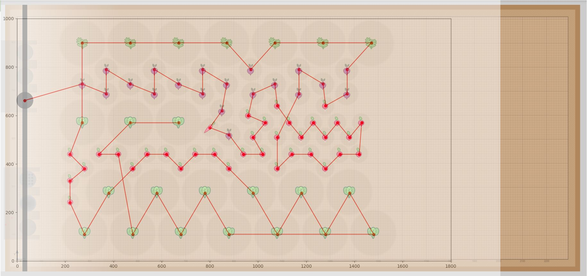

# [FARMWARE] PowerLoop for Farmbot

Loop your Farmbot by plants with filters, or by automatic waypoint calculation to cover plant search results grid area.

> FARMBOT_OS 6. Tested only on 7.0.1 for now. Should work on 6. Please open an [issue](./issues) with problems with other versions.

> Originally forked from [Loop-Plants-With-Filters](https://github.com/rdegosse/Loop-Plants-With-Filters), thank you @rdegosse!


## Installation

Go to [My Farmbot -> Farmware](https://my.farm.bot/app/farmware/), then paste the manifest.json path to install:
```
https://raw.githubusercontent.com/amerkay/powerloop/master/manifest.json
```

## Devs welcome

I tried to add as much comments and documentation within the files. Also, if you want to use one of the files in your own project, I made sure they are as self-contained and documented as possible.


## PowerLoop's Features

- Load all plants for current device from Farmbot API.

- Filter plants by plant name, Openfarm slug, age in day range. meta data key/value, and coordinates. [See manifest.json](manifest.json).

- Sort resulting plants or Grid waypoints using simple sort(x, y), or using Travelling Salesman Greedy Algorithm by setting 'Use Travelling Salesman Problem Greedy algorithm' to 'True'.

- Calculate grid coverage waypoints, using (optionally filtered) plant list as input. This is useful when you want to scan your garden with multiple photos, run the deweeding algorithm, or simply water say 3 seconds each 25x25cm area rathar than each plant. See example section.

- Execute list of sequences (initial, before each move, after each move, end).

- Offset X and Offset Y for each move. Can be set to `randint(i,j)` to randomize the X Y offset. One use case is for repetitive tasks like watering seedlings that you don't want to harm with the water pressure, e.g set offset `randint(-20,20)` to randomize movement by +/- 2cm.

- Loop all filtered plants
    - Move to plant coordinate (X, Y) with offset X, offset Y, default Z and default speed
    - Save meta data key/value, if set
    - Save plant_stage value, if set
    - Runs before and after list of sequences, if set


*Fig. 1: Travelling Salesman Solution to filtered list of plants*


## PowerLoop's Input Variables Documentation

[See manifest.json](manifest.json), includes extra "help" key with more information.

## Example usages

1. [Automatic Farmbot Garden Selfie](./examples/Automatic%20Garden%20Selfie.md), automate taking photos/weed detecion of your plants with the least number of waypoints to visit.

2. Water all plants, two modes, basic and using 'Water Doser' farmware for calculating how many seconds to water each plant individually.